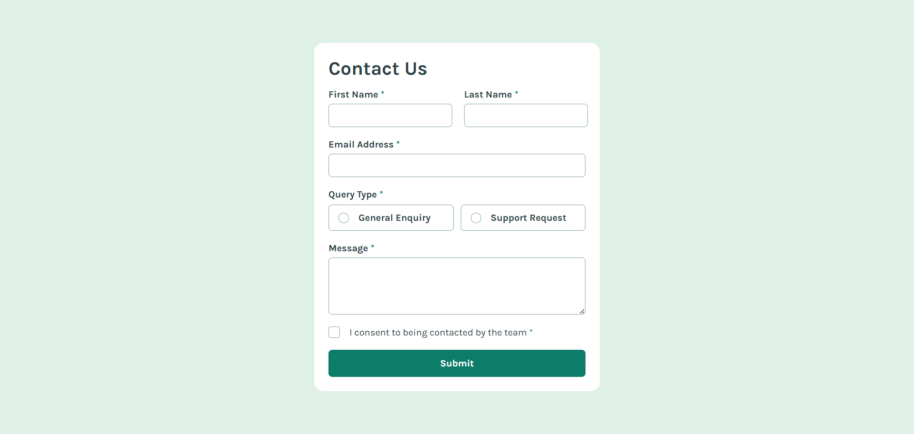

# Frontend Mentor - Contact Form Solution

This is a solution to the [Contact form challenge on Frontend Mentor](https://www.frontendmentor.io/challenges/contact-form--G-hYlqKJj).

## Table of contents

- [Overview](#overview)
  - [The challenge](#the-challenge)
  - [Screenshot](#screenshot)
  - [Links](#links)
- [My process](#my-process)
  - [Built with](#built-with)
  - [What I learned](#what-i-learned)
  - [Continued development](#continued-development)
- [Author](#author)

## Overview

### The challenge

Users should be able to:

- Complete the form and see a success message after submitting
- Receive form validation messages if:
  - A required field has been missed
  - The email address is not formatted correctly
- Complete the form only using their keyboard
- Have inputs, error messages, and the success message announced on their screen reader
- View the optimal layout for the interface depending on their device's screen size
- See hover and focus states for all interactive elements on the page

### Screenshot



### Links

- Solution URL: [GitHub Repository](https://github.com/Ismaellerakotoson/contact-form.git)
- Live Site URL: [Live Demo](https://ismaellerakotoson.github.io/contact-form/)

## My process

### Built with

- Semantic HTML5 markup
- CSS custom properties
- Flexbox
- Mobile-first workflow
- Vanilla JavaScript (DOM manipulation, form validation)

### What I learned

This challenge was a good opportunity to practice custom form validation from scratch, without relying on the browser's default `required` styling, and to think carefully about how validation states should be communicated to screen reader users.

One of the trickiest parts was getting the success notification to animate smoothly. My first attempt toggled the `hidden` attribute together with a `visible` class, but mixing an HTML attribute selector with a class selector created CSS specificity conflicts where the wrong rule won. I also learned that `display` can't be transitioned, since the browser treats it as an all-or-nothing value rather than something it can interpolate. Switching to `opacity` and `visibility`, combined with `pointer-events: none`, solved both problems: the element fades and slides smoothly, and it isn't focusable or clickable while hidden.

```css
.top-notification {
  opacity: 0;
  visibility: hidden;
  pointer-events: none;
  transform: translate(-50%, -10px);
  transition: opacity 0.3s ease, transform 0.3s ease, visibility 0.3s ease;
}

.top-notification.visible {
  opacity: 1;
  visibility: visible;
  pointer-events: auto;
  transform: translate(-50%, 0);
}
```

On the JavaScript side, my first version validated all fields as a single combined condition, which meant every error message appeared or disappeared together, even for fields that were already valid. Splitting the validation into one independent check per field fixed that. Once the same four-line `add`/`remove` class pattern started repeating across six fields, I refactored it into a single helper using `classList.toggle()` with a boolean state:

```javascript
function manageError(element, state) {
  element.classList.toggle("visible", state);
  element.classList.toggle("hidden", !state);
}
```

This removed most of the duplication while still leaving room for the email field's extra branch, since it needs to distinguish between an empty field and a badly formatted one.

```javascript
const emailValue = email.value.trim();
const isEmailEmpty = emailValue === "";
const isEmailInvalidFormat = !emailRegex.test(emailValue);

if (isEmailEmpty) {
  emailError.textContent = "This field is required";
  manageError(emailError, true);
  isValid = false;
} else if (isEmailInvalidFormat) {
  emailError.textContent = "Please enter a valid email address";
  manageError(emailError, true);
  isValid = false;
} else {
  emailError.textContent = "";
  manageError(emailError, false);
}
```

For the radio buttons and checkbox, I learned to check a group's state with `Array.prototype.some()` after spreading a `NodeList` into an array, since `NodeList` doesn't support `some()` directly in every browser:

```javascript
const isQueryChecked = [...queryRadios].some((radio) => radio.checked);
```

### Continued development

- Move keyboard focus to the first invalid field after a failed submission, so keyboard and screen reader users don't have to search the page for the error.
- Clear any pending `setTimeout` before starting a new one, so that submitting the form twice in quick succession doesn't hide the success notification earlier than expected.
- Test the full flow with NVDA to confirm that `aria-live="polite"` reliably announces each error message, particularly since messages toggle visibility via classes rather than always staying in the DOM.

## Author

- Frontend Mentor - [@Ismaellerakotoson](https://www.frontendmentor.io/profile/Ismaellerakotoson)
- GitHub - [@Ismaellerakotoson](https://github.com/Ismaellerakotoson)